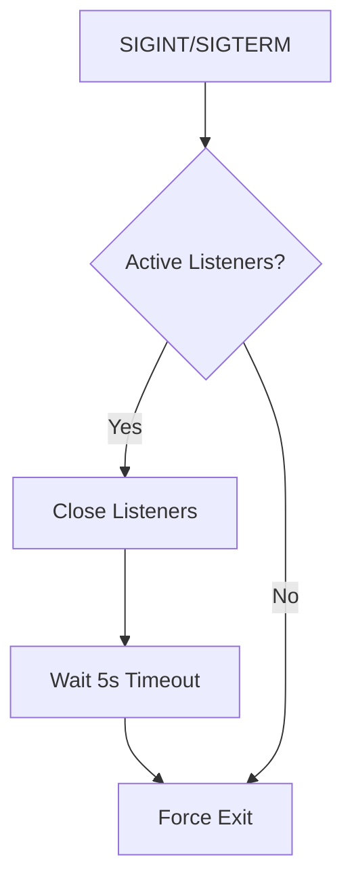

# PortHog 🐖

A minimalist port occupier that aggressively holds TCP ports for testing and development purposes.

Perfect for reserving ports during CI/CD pipelines or local environment setup.

---

## Features 🚀

- **Multi-port** occupancy with comma-separated values
- **Port range** support using `start-end` syntax
- **Instant connection termination** (RST packets)
- **Graceful shutdown** with `SIGINT/SIGTERM` handling
- **Connection monitoring** with detailed logging
- **Zero dependencies** easy to use

## Installation 📦

```bash
# Install latest version
go install github.com/WolfYangFan/PortHog@latest
```

## Usage 💻

### Basic Syntax

```bash
porthog -p PORT_SPEC
```

### Examples

```bash
# Single port + range combination
porthog -p 8080,9000-9005,12345

# Development mode with debug logs
porthog -p 3000-3010 --level debug
```

### Sample Output

```log
2025/01/30 INFO PortHog started version=dev commit=unknown pid=114514
2025/01/30 INFO Port occupied successfully port=80
2025/01/30 INFO Received signal - initiating graceful shutdown... signal=interrupt
2025/01/30 DEBUG Closing listener port=80
2025/01/30 DEBUG Stopping listener port=80
2025/01/30 INFO Shutdown completed
```

## Technical Details 🔧

### Port Handling
- Uses raw TCP listeners with `SO_REUSEADDR`
- Immediate connection reset (SO_LINGER=0)
- Background goroutine per port

### Signal Handling


## Contributing 🤝

1. Fork the repository  
2. Create your feature branch (`git checkout -b feature/amazing-feature`)  
3. Commit changes (`git commit -m 'Add amazing feature'`)  
4. Push to branch (`git push origin feature/amazing-feature`)  
5. Open a Pull Request  

Please follow our [Code of Conduct](CODE_OF_CONDUCT.md).

## License 📜

MIT License - see [LICENSE](LICENSE) for details.

---

> "Hog those ports like there's no tomorrow!" 🐽💻